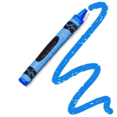

#  crayon
=====

A very fast, clean, and flexible way to use ANSI colors on your terminal. Crayon supports 256 colors, a clean and chainable API, a few other nifty features, and built-in logging.

It works as a drop-in replacement for [chalk](https://github.com/sindresorhus/chalk), but is much faster (~20x) and has additional features. Like chalk, it doesn't monkeypatch the `String` prototype the way that the popular [colors](https://github.com/marak/colors.js/) module does.

## Usage

```js
var crayon = require('crayon');

// Log a string
crayon.red.log('This is red');

// Style a string
console.log(crayon.blue('Hello world!'))

// Use any CSS color name
crayon.olivedrab.bgOldlace.info("cute");

// Use hex colors
crayon("#ffcc00").log("old gold");

// Use ANSI color codes
crayon(100).log("look at me");

// Combine styled and normal strings
console.log(  crayon.blue('Hello'), 'World' + crayon.red('!')  );

// Compose multiple styles using the chainable API
console.log(  crayon.blue.bgRed.bold('Hello world!')  );

// Or just compose styles by passing strings to the crayon function
crayon('red bgblue').log('this is red on a blue background');

// Nest styles
console.log(  crayon.red('Hello', crayon.underline.bgBlue('world') + '!')  );

// Pass in multiple arguments
crayon.blue.info('Hello', 'World!', 'Foo', 'bar', 'biz', 'baz');

// Specify multiple styles
crayon("goldenrod", "bg:blue", "inverse").underline.log("Hi!");

// Specify foreground and background colors
crayon.foreground("#ffffff").background("crimson").log("school!");
crayon.fg("navy").bg("#ffcc00").log("spirit!");
crayon.fgbg("white", "red").underline.error("whew");
crayon.red._("background:goldenrod").inverse.log("goldenrod on red");

// Specify a custom logger
crayon.logger = require('npmlog');

```

For color descriptions passed to functions, you can use any of the following:
- The name of any CSS color (case-insensitive)
- Any hex color (case-insensitive, leading '#' is optional)
- Any ANSI color code 0-255 as a Number

## Notes

- Depending on your settings, there may be a difference between the system red color and the color most closely matching the CSS color red. In the case of color name collisions, `crayon.red` will give you the system color and `crayon.red_` will give you the CSS color.
- For functions that aren't specific about whether they take a foreground or a background argument, you can pass `bg:<color>` or `background: <color>` or `bg<Color>` or similar, etc. to change the background color.
- The reason that this module is much faster than chalk is that chalk remakes the style functions each time you call them whereas crayon keeps them around if you reuse them.

